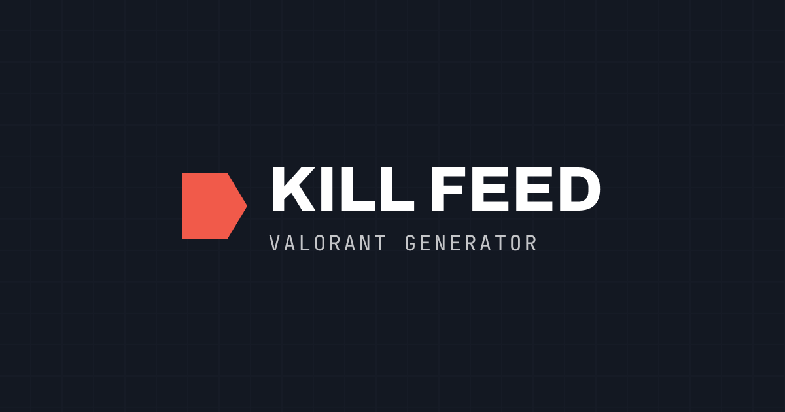

# Valorant Kill Feed Generator

Generate Valorant-style kill feed banners for your clips — pick agents, weapons or abilities, team colors, headshots and wallbangs, then export as a transparent PNG.

Live: [killfeed.hndr.xyz](https://killfeed.hndr.xyz/) · Source: [github.com/hendraaagil/killfeed](https://github.com/hendraaagil/killfeed)

## Features

- **Agents** — every playable agent (portraits from valorant-api).
- **Loadout** — weapons _or_ the killer agent's abilities.
- **Team colors** — editable teammate/enemy colors (defaults `#67C4A1` / `#F15A4A`).
- **Yellow outline** — teammate outline with `glow` / `inner` styles.
- **Extras** — headshot, wallbang, and swap (who kills who).
- **Live preview** — fit-to-width, fixed 72px banner.
- **Export** — one-click transparent PNG (`html-to-image`).

## Stack

- React 19 + TypeScript + Vite
- Tailwind CSS v4 (`@theme` tokens)
- Bun, Oxlint, Prettier
- Data: [valorant-api.com](https://valorant-api.com/)

## Development

```bash
bun install
bun run dev        # start dev server
bun run build      # typecheck + production build
bun run lint       # oxlint
bun run format     # prettier --write
```

## Credits

Game & assets by [VALORANT](https://playvalorant.com/en-us/) · data from [valorant-api.com](https://valorant-api.com/) · font [Barlow](https://fonts.google.com/specimen/Barlow).

Not affiliated with or endorsed by Riot Games.
